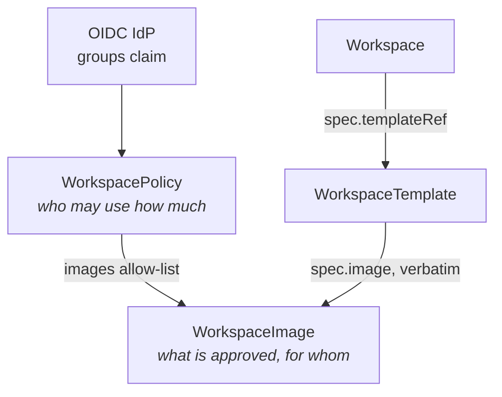

# Governance

WaaS governance is admin-defined guardrails around self-service: the
admin approves **images** (the catalog) and assigns **limits**
(policies) to IdP users/groups; users deploy freely inside that
envelope — through the portal or straight at the Kubernetes API, the
rules are identical.

## The model


```mermaid
flowchart TB
    IdP[OIDC IdP<br/>groups claim] --> WSP[WorkspacePolicy<br/><i>who may use how much</i>]
    WSP -->|images allow-list| WSI[WorkspaceImage<br/><i>what is approved, for whom</i>]
    WS[Workspace] -->|spec.templateRef| WT[WorkspaceTemplate]
    WT -->|spec.image, verbatim| WSI
```

- **[`WorkspaceImage`](../reference/crds/workspaceimage)**: one
  approved image — exact ref (pin the digest), protocols,
  architectures, an `enabled` kill-switch, `allowedGroups`, and
  default/min/max sizing.
- **[`WorkspacePolicy`](../reference/crds/workspacepolicy)**: priority,
  subjects (`User`/`Group`), image subset, limits (`maxWorkspaces`,
  `maxRunningWorkspaces`, `perWorkspace`, `aggregate`), lifecycle
  (`idleSuspendAfter`, `maxLifetime`), clipboard rules, override rights.
- A user's **effective images** = enabled catalog ∩ policy `images` ∩
  `allowedGroups` match. The same function feeds the webhook, the
  reconciler and the portal — they cannot disagree.

## Policy resolution

Among policies whose subjects match the user, the **highest
`spec.priority` wins and applies as a whole** — no field merging.
`subjects: []` matches every authenticated user. **No matching policy =
denial** (fail closed).

Convention: `0` the default fallback, `100–999` group policies, `1000+`
per-user exceptions, `10000` the admins policy.

Two bootstrap policies can be rendered by the Helm chart:

- `defaultPolicy` (**on** by default): a catch-all at priority 0 with a
  modest quota — without it, a fresh install would deny everyone.
- `adminPolicy` (off by default): an explicit all-rights policy for
  platform admins — the bypass is a visible, auditable CR, not a code
  path.

The exact rights each one grants (and the catalog entries bootstrapped
alongside) are detailed in
[What the chart bootstraps](../admin/bootstrap-governance.md).

Debugging: the admin console (Users page) embeds an
**effective-policy** view that replays the exact resolution the webhook
performs — every candidate policy, its match outcome, the winner and
any tie warnings.

## The admission decision

Every workspace creation or spec change runs the full matrix,
server-side, in the admission webhook (and again in the reconciler
before compute is created):

identity → policy match → image in catalog → image enabled → image
allowed for your groups → template protocols served by the image →
sizing within image and policy bounds → count and aggregates within
quota.

Denials read `[ReasonCode] human message with the numbers` — surfaced
verbatim by kubectl, mapped to HTTP 403 by the API, stored in the
`Ready` condition, and shown by the portal. Common reason codes:
`NoPolicyMatches`, `ImageNotInCatalog`, `ImageDisabled`,
`ImageNotAllowed`, `ProtocolMismatch`, `ResourcesOutOfBounds`,
`QuotaExceeded`, `IdentityViolation`.

Notable properties:

- **Grandfathering**: an unchanged spec is always re-admitted; running
  workspaces are never torn down by a policy change (they still count
  toward quotas). The exception is lifecycle: `maxLifetime` deletes
  expired workspaces, `idleSuspendAfter` pauses session-less ones.
- **Pausing is exempt** from override checks — it only frees compute,
  so a workspace that no longer complies can always be paused; resuming
  re-runs the full check.
- **Identity is trusted, not declared**: with kubectl, `spec.owner`
  must equal your authenticated username, and it is immutable
  afterward. Spoofing another owner is denied (`IdentityViolation`).

## Two workspace quotas: ownership vs concurrency

The policy has two independent per-user counts:

- **`maxWorkspaces` caps ownership** — how many workspaces a user may
  *have*. Paused workspaces count: their home PVC still holds storage.
- **`maxRunningWorkspaces` caps compute concurrency** — how many may be
  *running* at once. Paused workspaces and retained volumes do **not**
  count: pausing frees a slot, resuming re-acquires one.

The running quota guards the two transitions **into** compute —
creating a non-paused workspace and resuming a paused one. When the
slots are full the webhook denies with

```
[QuotaExceeded] policy "…": running workspace quota reached (2/2); pause a workspace to free a slot
```

surfaced as usual (kubectl error, HTTP 403, `Ready` condition, portal
card). A denied resume is working as designed — pause or delete another
workspace to free the slot.

Because only the *running* state is capped, a workspace can be
**created paused** (`spec.paused: true` at creation, or the portal's
"create paused" choice when your slots are full): it exists, owns its
home volume, counts toward `maxWorkspaces` — but takes no running slot
until its first resume, which runs the full admission check.

Either field absent means unlimited on that axis. The portal banner
shows both counters (`used/max` workspaces and running).

## Clipboard policy

`spec.clipboard` gates the two directions independently
(`copyFromWorkspace`, `pasteToWorkspace`; absent = allowed). The grant
is stamped into the connection token at session start and enforced by
the proxy on the wire — no policy match means both directions denied
while the session itself still opens. Templates and connection
parameters can only restrict further, never widen.

## Override restriction

`spec.overrides.allowedFields` on the policy bounds template overrides
for the governed users; the effective allow-list is the **intersection**
with the template's own list. Absent block = no policy restriction;
empty list = all overrides forbidden. Platform admins bypass both
lists; a template's `owner` bypasses the template list only.

:::warning `volumes` and the security contexts are not like the others

Most fields on that list are bounded by their own type — `resources` is
capped by your limits, `schedule` is a pair of crons. `volumes`,
`securityContext` and `podSecurityContext` are not: they are
pod-spec-shaped, and the allow-list gates the field without inspecting
its content. Granting `volumes` lets a user mount any Secret present in
the workspace namespace; `securityContext` includes `privileged: true`,
and `podSecurityContext` includes `runAsUser: 0` and `sysctls`.

Read [what delegating these rights
grants](../accepted-limitations#before-you-delegate-these-rights-admins)
before adding any of them to a policy. The bootstrap default policy
grants none of them — but an install upgraded from chart 0.2.x may
still carry `volumes`.

:::

## Everyday admin procedures

**Approve an image**: add a `WorkspaceImage` with the exact ref (Git or
admin console) → create a `WorkspaceTemplate` using that ref →
reference it from policies (or leave `images: []` for "whole catalog").

**Change a quota**: edit the `WorkspacePolicy`. Applies to new
creations/resumes immediately; running workspaces untouched until their
next spec change.

**Emergency-disable an image**:

```sh
kubectl patch wsi <name> --type=merge -p '{"spec":{"enabled":false}}'
```

New workspaces are blocked instantly; running ones keep working (pause
them from the console if the image is actively dangerous).

**GitOps note**: the admin console edits these CRs directly — CRDs are
the source of truth, Git seeds them. If ArgoCD manages them, a UI edit
is a manual override that the next sync overwrites; configure
`selfHeal`/`ignoreDifferences` accordingly.

## Sessions

Signing in — locally or through SSO — sets an **httpOnly session
cookie**. Nothing else: the portal stores no token, in `localStorage` or
anywhere else, and page scripts cannot read the cookie. There is no
credential in the browser for a malicious script to steal.

What that means day to day:

- **Reloading the page keeps you signed in.** The cookie survives it; the
  portal re-reads your profile on load.
- **Nothing appears in the URL.** After an SSO round-trip you land on the
  portal with a clean address bar.
- Sessions last `apiServer.accessTokenTTL` (8 h by default). That bound is
  a fallback, not the security control — see below.

### Changes take effect on the next request, not in 8 hours

Every authenticated request re-checks the account behind the session. So
these are **immediate**, without waiting for any token to expire:

| Action | Effect |
|---|---|
| Deactivate a user | Their next request is refused |
| Change a user's role | Their session stops; they sign in again with the new role |
| Reset or change a password | Existing sessions end |
| Sign out | Every session of that account ends |

**When the target is you, you are signed out on the spot** — not on your
next click. Changing your own password on the Profile page, demoting
yourself from the Users page, or deactivating / password-resetting your
own account through the API, ends the session that made the change: the
portal returns you to the login page with a notice naming what happened,
rather than looking signed in until something 401s. Signing you back in
on the spot would not work either: the new session would be issued in the
same second as the revocation and be refused by it.

:::warning You cannot strand the platform without an administrator

Demoting or deactivating the **last active administrator** is refused:

```
the platform must keep at least one active administrator — promote another
account first
```

There is no way back from zero admins through the product. The
`WAAS_ADMIN_PASSWORD` bootstrap only ever seeds an **empty** user table —
it never re-applies to an existing account, so a redeploy would not
restore your access. Recovering would mean editing the database by hand.

Promote a second administrator *first*, then demote yourself.

:::

:::warning Signing out is global, not per device

Signing out on one browser ends that account's sessions **everywhere**.
That is the intended default for a security control — per-device sign-out
would require the platform to track each session individually, which it
deliberately does not.

:::

**One residual to know**: a desktop connection already open keeps running
until it is closed. The tunnel is authorized once, when the connection
opens, so revocation gates every *new* connection rather than tearing
down a live one. Pause or delete the workspace to cut an in-progress
session immediately.

### Scripts and CI

The cookie is for browsers. Anything else authenticates with the
`Authorization: Bearer` header, using the token `POST /api/v1/auth/login`
returns:

```sh
TOKEN=$(curl -s -X POST https://waas.example.com/api/v1/auth/login \
  -H 'Content-Type: application/json' \
  -d '{"username":"ci","password":"…"}' | jq -r .data.accessToken)

curl -H "Authorization: Bearer $TOKEN" https://waas.example.com/api/v1/workspaces
```

The same rules apply to it — deactivate the account and the token stops
working on the next call.

## Audit

The api-server journals `workspace.created/denied/paused/resumed`,
`catalog.image_*` and `policy.*` events (who, what, when, which policy,
client IP) in an **append-only** audit table. The operator emits
Kubernetes Events for every admission decision and phase transition.
