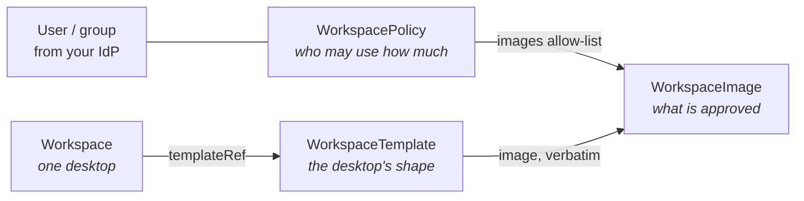

# Concepts

Everything in WaaS revolves around four CRDs in the
`waas.xorhub.io/v1alpha1` API group:

- A **[`WorkspaceTemplate`](../reference/crds/workspacetemplate.mdx)**
  describes a desktop: image, sizing, protocols (VNC/RDP/SSH/KasmVNC),
  workload kind, uptime schedule, and which fields users may override.
- A **[`Workspace`](../reference/crds/workspace.mdx)** instantiates a
  template for one owner. It carries little more than the template
  reference, the owner, and the user's allowed overrides.
- A **[`WorkspaceImage`](../reference/crds/workspaceimage.mdx)** is a
  catalog entry: an admin-approved image (or whole registry) with its
  supported protocols, architectures, and sizing bounds.
- A **[`WorkspacePolicy`](../reference/crds/workspacepolicy.mdx)** is the
  self-service envelope for a user or group: image subset, quotas,
  lifecycle (idle suspend, max lifetime), clipboard rules, override
  rights.

The pages in this section cover each mechanism in depth:

| Page | What it explains |
|---|---|
| [Workspace lifecycle](workspace-lifecycle.md) | Phases, conditions, pause/resume, scheduled uptime/downtime |
| [Templates and protocols](templates-and-protocols.md) | Workload kinds, VNC/RDP/SSH/KasmVNC, credentials, user overrides |
| [Governance](governance.md) | Catalog + policies: who may create what, enforcement, audit |
| [Placement](placement.md) | Which namespace workloads land in, naming, quotas per namespace |
| [Volumes](volumes.md) | Home volume retention, reuse and quotas |
| [Workspace deletion](workspace-deletion.md) | What gets destroyed, what survives, how to unblock a stuck teardown |
