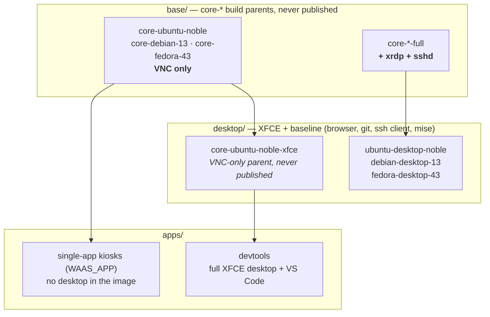
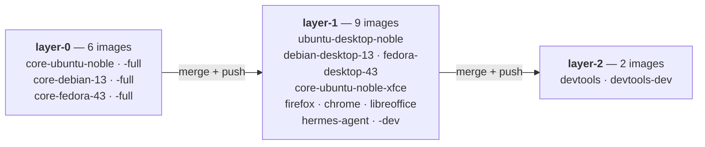

# Workspace images

Linux workspaces run OCI images from the
[waas-images](https://github.com/XoRHub/waas-images) project —
Kasm-style, 100% OSS desktop images purpose-built for the platform.

## Design in one paragraph

TigerVNC's **Xvnc is the display server** (no Xvfb double stack): it
serves RFB natively — exactly what guacd's VNC client speaks — and
supports dynamic resize. **RDP is a bridge**: xrdp without sesman/PAM,
its `libvnc` backend pointed at the local Xvnc, fully non-root — both
protocols always show the same session. Services run under **tini +
supervisord**, entirely unprivileged; the entrypoint renders all
mutable config into tmpfs so the **root filesystem can be read-only**.
The web client is guacd/wwt from the platform — no noVNC in the
images. Every image boots in CI with `--read-only --cap-drop ALL
--security-opt no-new-privileges` and must pass a real protocol
handshake — the hardening checklist is enforced, not aspirational.

## How the images are built

Every image declares one parent (`from:` in its manifest), which CI
resolves to the exact ref built earlier in the same pipeline. An image
contains its own layer plus every ancestor's — so **capability is
inherited, never added later**: a per-app kiosk cannot serve SSH
because the core it descends from never installed sshd, and `devtools`
gets Firefox, git and mise for free because it descends through the
desktop layer.



The two core rows are siblings, not a chain: one Dockerfile builds
both, `INSTALL_RDP`/`INSTALL_SSH` decides which binaries land. That is
why the multi-protocol desktops descend from `-full` while everything
VNC-only descends from the bare core — and why a `-dev` variant is a
separate **tag** from the same build, not a runtime flag.

### Build order

CI derives each image's **depth** from that parentage — 0 for a root,
parent + 1 otherwise — and builds one depth at a time:



Within a wave everything runs in parallel — one job per image **per
architecture**, each doing build → smoke → scan, then a merge job that
publishes the multi-arch index. The next wave cannot start before that
merge: a child's `BASE_IMAGE` is the exact ref its parent just pushed,
which is what makes a change to a base propagate through the whole tree
in a single pipeline run.

Depth is a *consequence* of `from:`, not something you set. Only
`devtools` reaches depth 2 today, and the generator hard-fails above it
— `.github/workflows/build.yml` wires exactly three `layer-N`/`merge-N`
pairs, so a deeper tree is a deliberate ~10-line change there, never a
silent one.

**VNC is the recommended protocol for Linux**; RDP is a compatibility
option, and SSH exists only on the OS-level desktop images — on the
kiosks the xrdp and sshd binaries are simply absent, not merely
disabled. The `WAAS_APP` session mode runs a kiosk's one application
undecorated and maximized, with no panel, terminal or window-manager
keybindings behind it.

The OS desktops ship a **working baseline**, not a bare XFCE:
Firefox, git, an **ssh client**, curl, vim and less — enough to clone,
edit and push without installing anything first. `devtools` inherits
that and adds VS Code plus the system build toolchain on top; the
kiosks deliberately do not, having no shell to use it from.

## The contract with the Workspace CR

Any image honoring this contract works as a WaaS Linux workspace —
that's the whole interface, whether the image comes from waas-images or
[your own build](build-your-own.md):

| Aspect                          | Value                                                                                                                                                                                                                                                                                                                                                                      |
| ------------------------------- | -------------------------------------------------------------------------------------------------------------------------------------------------------------------------------------------------------------------------------------------------------------------------------------------------------------------------------------------------------------------------- |
| VNC port                        | `5901` (RFB, VncAuth) — the default for `os: linux`                                                                                                                                                                                                                                                                                                                        |
| RDP port                        | `3389` (TLS negotiated) — only images built with RDP support, enabled via `WAAS_RDP_ENABLED=1`                                                                                                                                                                                                                                                                             |
| SSH port                        | `2222` — publickey only, OS-level desktop images only, opt-in via `WAAS_SSH_ENABLED=1`                                                                                                                                                                                                                                                                                     |
| Audio                           | PulseAudio native protocol on `4713`, streamed by guacd when the session enables audio                                                                                                                                                                                                                                                                                     |
| Readiness                       | TCP open on the template port ⇔ the protocol server accepts connections (matches the operator's probes)                                                                                                                                                                                                                                                                    |
| User                            | `waas_user`, UID/GID `1000:1000`, home **`/home/waas_user`** = the operator's PVC mount; fresh volumes are seeded from `/etc/skel`                                                                                                                                                                                                                                         |
| Writable paths                  | `/home/waas_user` (PVC), `/tmp`, `/run` (emptyDirs) — everything else read-only-safe                                                                                                                                                                                                                                                                                       |
| Required env                    | **`WAAS_DESKTOP_PASSWORD`** — one session password shared by VNC and RDP. The image **refuses to start without it**. Legacy names (`VNC_PW`, `RDP_PASSWORD`) are refused with an explicit error.                                                                                                                                                                           |
| Optional env                    | `WAAS_VNC_RESOLUTION`, `WAAS_VNC_COL_DEPTH`, `WAAS_VNC_ENABLED`, `WAAS_RDP_ENABLED`, `WAAS_RDP_AUTH_ENABLED`, `WAAS_SSH_ENABLED`, `WAAS_SSH_AUTHORIZED_KEYS(_FILE)`, `WAAS_SSH_HOST_KEY_FILE`, `WAAS_STARTUP` (full session command), `WAAS_APP` (single-app kiosk command — mutually exclusive with `WAAS_STARTUP`), `WAAS_AUDIO_ENABLED`, `WAAS_TLS_CERT`/`WAAS_TLS_KEY` |
| Init hook                       | optional ConfigMap mounted at `/etc/waas/init.d/` — `*.sh` sourced at boot, as UID 1000                                                                                                                                                                                                                                                                                    |
| Recommended pod securityContext | `runAsNonRoot`, `runAsUser/fsGroup: 1000`, `readOnlyRootFilesystem: true`, `capabilities.drop: [ALL]`, `allowPrivilegeEscalation: false`, `seccompProfile: RuntimeDefault` → PodSecurity **restricted** compliant                                                                                                                                                          |

Every runtime variable is `WAAS_`-prefixed — that is the whole naming
contract. Under the platform you rarely set the password yourself:
when a template has no explicit credential source, the operator
generates a per-workspace password and injects `WAAS_DESKTOP_PASSWORD`
via `secretKeyRef` on its own (see
[Credentials](../concepts/templates-and-protocols.md#credentials)).

Security defaults worth knowing:

- **RDP authentication is on by default** and has no build-time
  opt-out — an image can never leave the pipeline with an open RDP.
- **SSH is publickey-only by construction**: the unprivileged sshd
  cannot read `/etc/shadow`, so password auth is impossible.
- No secrets are ever baked into layers; the password arrives via env
  at runtime, is hashed into tmpfs and scrubbed from the environment.
- `-dev` tagged variants (e.g. `devtools-dev`) are a documented reduced
  profile — sudo baked in, requires a relaxed pod securityContext —
  meant to be gated behind `allowedGroups` in the catalog. Reach for
  one only when you genuinely need system packages: for language
  runtimes and CLI tools, the hardened image is enough (see below).

## Installing tools that survive a restart

Only `/home/waas_user` is a volume, so anything `apt install` writes
lands in the container layer and dies with the pod. The desktop images
therefore ship **mise**: it installs language runtimes and CLI tools
under `~/.local/share/mise` — on the home PVC — so they survive
restarts, pauses and image changes exactly like the rest of the home.

```bash
mise use -g node@22      # persists; still there after a pod restart
mise use -g python@3.13
```

It needs no privileges and writes nothing outside `$HOME` and `/tmp`,
so it works on the **hardened** images under a read-only root
filesystem. A workspace that only needs a runtime or a CLI tool
therefore does **not** need a `-dev` tag.

What it does not cover: **system libraries**. Anything requiring a
shared object, a codec or an apt package's maintainer scripts still
means `sudo apt install` on a `-dev` image — and that is still lost on
restart. Two consequences worth knowing: what a user installs this way
lives on the PVC, so it sits outside the image's trivy gate and SBOM by
construction; and mise's shims come first on `PATH`, so a
user-installed `python3` shadows the image's own.

## Which images exist?

The list of published images is deliberately **not** duplicated here —
it changes with every release. The authoritative, machine-readable list
is the catalog the platform itself syncs from:
[`catalog-waas-images.yaml`](https://github.com/XoRHub/waas-images/blob/main/catalog-waas-images.yaml)
(and
[`catalog-kasmweb.yaml`](https://github.com/XoRHub/waas-images/blob/main/catalog-kasmweb.yaml)
for the optional upstream Kasm images). Roughly: OS desktops
(Ubuntu/Debian/Fedora XFCE, multi-protocol) and per-app images
(Firefox, Chrome, LibreOffice, VS Code devtools) on amd64 + arm64.

Image tags are **immutable** (`<version>`, plus throwaway
`<version>-g<sha>` branch tags); published images are cosign-signed
with a CycloneDX SBOM attested to the image reference.

The interesting part is building your own → next page.
