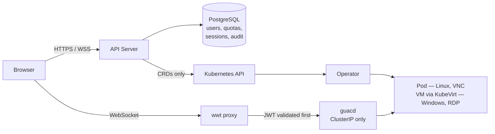

# What is WaaS?

WaaS is an open-source, **Kubernetes-native Workspace-as-a-Service**
platform. You `helm install` it on any cluster — the only prerequisite is
[cert-manager](https://cert-manager.io/) — and give people a full remote
desktop, accessible from any browser:

- **Linux desktops** run as pods and are reached over VNC (with RDP and
  SSH as additional protocols when the image supports them);
- **Windows desktops** run as KubeVirt VMs and are reached over RDP —
  KubeVirt is auto-detected, never required.

{/* TODO(image): capture du portail utilisateur listant les workspaces (cards avec phase/protocole) */}

## Workspaces as code, GitOps-first

A workspace is a **Kubernetes resource**. You create it with `kubectl
apply`, ArgoCD or Flux like anything else in the cluster — or from the
web portal, which goes through the exact same CRDs. Four CRDs (group
`waas.xorhub.io/v1alpha1`) drive the whole platform:

| CRD | Short name | Role |
|---|---|---|
| [`Workspace`](reference/crds/workspace) | — | One user's desktop: which template, who owns it, paused or running. |
| [`WorkspaceTemplate`](reference/crds/workspacetemplate) | — | The shape of a desktop: image, sizing, protocols, workload kind, schedule, what users may override. |
| [`WorkspacePolicy`](reference/crds/workspacepolicy) | `wsp` | Admin guardrails: who may create how many workspaces, of which images, with which limits. |
| [`WorkspaceImage`](reference/crds/workspaceimage) | `wsi` | A catalog entry: one admin-approved image (or registry) with its protocols and sizing bounds. |

Governance is enforced **server-side** by an admission webhook — going
straight at the Kubernetes API with `kubectl` gives you the same rules
as the portal, never fewer.

## Architecture

{/* TODO(image): schéma d'architecture propre (Browser → API Server → K8s API → Operator → pod/VM ; wwt → guacd) */}

What each piece does, from an operator's point of view:

- The **API server** is the platform's REST API: authentication (local
  accounts and OIDC SSO), RBAC, quotas, audit. It creates workspaces
  **only through the CRDs** — never pods directly.
- The **operator** reconciles `Workspace`/`WorkspaceTemplate` resources
  into Deployments, Services and PVCs (Linux) or KubeVirt VMs (Windows).
  It talks to the Kubernetes API only.
- **wwt**, the WebSocket proxy, validates your session JWT **before**
  opening any TCP connection to guacd. guacd — the Apache Guacamole
  daemon that speaks VNC/RDP/SSH to the desktop — stays ClusterIP-only
  and is never exposed outside the cluster.
- The **frontend** is the React portal (user dashboard + admin console).
  It only ever talks to the API server.

These boundaries are hard rules of the platform, not implementation
details — they are what makes the GitOps path (plain `kubectl apply`)
a first-class citizen rather than a side door.

## Where the desktop images come from

Linux workspaces run OCI images from the sibling
[waas-images](https://github.com/XoRHub/waas-images) project:
Kasm-style, 100% OSS desktop images (TigerVNC, optional xrdp/sshd,
XFCE, per-app variants) built to run **unprivileged with a read-only
root filesystem**. You can also approve any third-party image that
honors the [image contract](images/index.md#the-contract-with-the-workspace-cr),
or [build your own](images/build-your-own).

## Next steps

- [Quickstart](quickstart) — install WaaS and open your first desktop.
- [Concepts](concepts/) — templates, lifecycle, policies, volumes.
- [CRD reference](reference/crds/) — every field, generated from the schemas.

WaaS is Apache-2.0 licensed — community edition, free forever.
