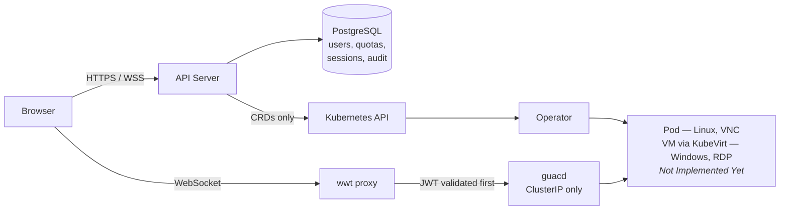

# What is WaaS?

WaaS is an open-source, **Kubernetes-native Workspace-as-a-Service**
platform. You `helm install` it on any cluster — the only prerequisite is
[cert-manager](https://cert-manager.io/) — and give people a full remote
desktop, accessible from any browser:

- **Linux desktops** run as pods and are reached over VNC (or KasmVNC,
  for the official Kasm images);
- **Windows desktops** run as KubeVirt VMs and are reached over RDP —
  KubeVirt is auto-detected, never required. (**Not Implemented Yet**)

## Workspaces as code, GitOps-first

A workspace is a **Kubernetes resource**. You create it with `kubectl
apply`, ArgoCD or Flux like anything else in the cluster — or from the
web portal, which goes through the exact same CRDs. Four CRDs (group
`waas.xorhub.io/v1alpha1`) drive the whole platform:

| CRD                                                         | Short name | Role                                                                                                |
| ----------------------------------------------------------- | ---------- | --------------------------------------------------------------------------------------------------- |
| [`Workspace`](reference/crds/workspace.mdx)                 | —          | One user's desktop: which template, who owns it, paused or running.                                 |
| [`WorkspaceTemplate`](reference/crds/workspacetemplate.mdx) | —          | The shape of a desktop: image, sizing, protocols, workload kind, schedule, what users may override. |
| [`WorkspacePolicy`](reference/crds/workspacepolicy.mdx)     | `wsp`      | Admin guardrails: who may create how many workspaces, of which images, with which limits.           |
| [`WorkspaceImage`](reference/crds/workspaceimage.mdx)       | `wsi`      | A catalog entry: one admin-approved image (or registry) with its protocols and sizing bounds.       |

Governance is enforced **server-side** by an admission webhook — going
straight at the Kubernetes API with `kubectl` gives you the same rules
as the portal, never fewer.

## Architecture

```mermaid
flowchart LR
    B[Browser] -->|HTTPS / WSS| A[API Server]
    A --> P[(PostgreSQL<br/>users, quotas,<br/>sessions, audit)]
    A -->|CRDs only| K[Kubernetes API]
    K --> O[Operator]
    O --> W[Pod — Linux, VNC<br/>VM via KubeVirt — Windows, RDP<br/><i>Not Implemented Yet</i>]
    B -->|WebSocket| X[wwt proxy]
    X -->|JWT validated first| G[guacd<br/>ClusterIP only]
    G --> W
```

What each piece does, from an operator's point of view:

- The **API server** is the platform's REST API: authentication (local
  accounts and OIDC SSO), RBAC, quotas, audit. It creates workspaces
  **only through the CRDs** — never pods directly.
- The **operator** reconciles `Workspace`/`WorkspaceTemplate` resources
  into Deployments, Services and PVCs (Linux) or KubeVirt VMs
  (Windows — **Not Implemented Yet**).
  It talks to the Kubernetes API only.
- **wwt**, the WebSocket proxy, validates your session JWT **before**
  opening any TCP connection to guacd. guacd — the Apache Guacamole
  daemon that speaks VNC to the desktops, and VNC, RDP or SSH to
  [remote machines](guides/remote-workspaces.md) — stays ClusterIP-only
  and is never exposed outside the cluster.
- The **frontend** is the React portal (user dashboard + admin console).
  It only ever talks to the API server.

These boundaries are hard rules of the platform, not implementation
details — they are what makes the GitOps path (plain `kubectl apply`)
a first-class citizen rather than a side door.

## Where the desktop images come from

Linux workspaces run OCI images from the sibling
[waas-images](https://github.com/XoRHub/waas-images) project:
Kasm-style, 100% OSS desktop images (TigerVNC over VNC only, XFCE,
per-app kiosks) built to run **unprivileged with a read-only
root filesystem**. You can also approve any third-party image that
honors the [image contract](images/index.md#the-contract-with-the-workspace-cr),
or [build your own](images/build-your-own.md).

## Next steps

- [Quickstart](quickstart.md) — install WaaS and open your first desktop.
- [Concepts](concepts/index.md) — templates, lifecycle, policies, volumes.
- [CRD reference](reference/crds/index.md) — every field, generated from the schemas.

WaaS is Apache-2.0 licensed — community edition, free forever.
